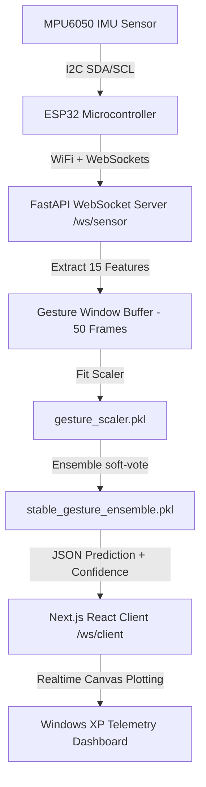

# Real-Time IMU Gesture Recognition Platform

An industrial-grade real-time gesture recognition and telemetry system that captures motion signals from an MPU6050 sensor connected to an ESP32 microcontroller, streams raw values over WebSockets, executes low-latency Support Vector Machine (SVM) ensemble predictions, and visualizes trajectories and results in a retro 2007 Windows XP inspired React/Next.js dashboard.

---

## 1. Project Directory Structure

```text
Gesture_Recognition_System/
│
├── Client/
│   ├── app/
│   │   ├── layout.js          # Next.js Root Layout with SEO tags
│   │   └── page.js            # Main Control Dashboard with Oscilloscope and Trajectory Canvases
│   ├── styles/
│   │   └── globals.css        # Retro Windows XP styled borders, scrollbars, and buttons
│   ├── next.config.js         # Next.js configurations
│   ├── postcss.config.js      # PostCSS configuration for Tailwind
│   ├── tailwind.config.js     # Tailwind configurations (custom retro colors, fonts)
│   └── package.json           # Frontend package dependencies (React, Next, lucide-react)
│
├── Server/
│   ├── main.py                # FastAPI app entry point (routes WebSocket clients and streams)
│   ├── websocket_handler.py   # Connection registry, data broadcasting, and recording manager
│   ├── prediction_engine.py   # Standardizes features, runs SVM prediction, and logs inferences
│   ├── model_loader.py        # Safety validator that reads model binary components
│   ├── gesture_buffer.py      # Double-buffered sliding queue; performs feature extraction
│   ├── requirements.txt       # Backend Python dependencies (fastapi, scikit-learn, joblib, numpy)
│   └── utils/
│       └── mock_sensor_client.py  # Interactive client to stream dataset samples without hardware
│
├── Models/
│   ├── stable_gesture_ensemble.pkl  # Pre-trained VotingClassifier Ensemble SVM Model
│   ├── gesture_scaler.pkl          # Fit StandardScaler for normalization (15 input dimensions)
│   ├── gesture_encoder.pkl         # Fit LabelEncoder mapping classes: Circle, Double Tap, etc.
│   └── gesture_features.pkl        # List of features: ax_mean, ax_std, ax_max, ax_min, ax_var, etc.
│
├── ESP32/
│   └── ESP32_Code.ino         # C++ Arduino firmware for WiFi, MPU6050 reading, and streaming
│
└── Results/
    ├── inference_results.txt  # Simple database table format (Timestamp, Gesture, Accuracy, Status)
    └── prediction_logs.txt    # Detailed technical log (Inference Latency, raw features)
```

---

## 2. System Architecture & Telemetry Pipeline



### Feature Engineering (15 Dimensions)
For a 50-frame discrete window (1 second of motion data captured at 50Hz), the system extracts the following statistical features from raw accelerometer inputs (`ax, ay, az` in m/s²):
1. **Means** (0-2): `ax_mean`, `ay_mean`, `az_mean`
2. **Standard Deviations** (3-5): `ax_std`, `ay_std`, `az_std`
3. **Maximums** (6-8): `ax_max`, `ay_max`, `az_max`
4. **Minimums** (9-11): `ax_min`, `ay_min`, `az_min`
5. **Variances** (12-14): `ax_var`, `ay_var`, `az_var`

---

## 3. Setup and Installation

### Backend Server Setup
1. **Prerequisites**: Python 3.8 to 3.11.
2. Navigate to the `Server` directory:
   ```bash
   cd Server
   ```
3. Install dependencies:
   ```bash
   pip install -r requirements.txt
   ```
4. Start the FastAPI development server:
   ```bash
   python main.py
   ```
   *The server will start listening on `http://localhost:8000`. WebSocket endpoints are exposed at `ws://localhost:8000/ws/sensor` (for ESP32) and `ws://localhost:8000/ws/client` (for React client).*

### Frontend React/Next.js Setup
1. **Prerequisites**: Node.js v18+.
2. Navigate to the `Client` directory:
   ```bash
   cd Client
   ```
3. Install package dependencies:
   ```bash
   npm install
   ```
4. Start the local Next.js development server:
   ```bash
   npm run dev
   ```
   *Open `http://localhost:3000` in your browser to view the retro XP dashboard control panel.*

### ESP32 Hardware Wiring
Connect the MPU6050 sensor to the ESP32 using the following I2C pin layout:

| MPU6050 Pin | ESP32 GPIO Pin | Connection Type |
|-------------|----------------|-----------------|
| **VCC**     | **3V3 / 5V**   | Power Supply    |
| **GND**     | **GND**        | Ground          |
| **SDA**     | **GPIO 21**    | I2C Data Line   |
| **SCL**     | **GPIO 22**    | I2C Clock Line  |

### ESP32 Firmware Installation
1. Open the [ESP32_Code.ino](file:///c:/Users/hp/Downloads/ML_Project/ESP32/ESP32_Code.ino) file in Arduino IDE.
2. **Library Requirements**:
   - Install `ArduinoJson` (by Benoit Blanchon) from the library manager.
   - Install `WebSockets` (by Markus Sattler) from the library manager.
3. Configure your local network credentials and Server settings at the top of the file:
   ```cpp
   const char* ssid     = "YOUR_WIFI_SSID";     // Your WiFi SSID
   const char* password = "YOUR_WIFI_PASSWORD"; // Your WiFi Password
   const char* server_host = "192.168.1.100";  // Host Computer IP Address running FastAPI
   ```
4. Select **ESP32 Dev Module** as the target board, connect the board via USB, select the correct Port, and click **Upload**.

---

## 4. Running end-to-end Simulation (Without Hardware)

If you do not have physical ESP32 and MPU6050 hardware on hand, you can simulate data streaming using the included mock client:
1. Start the FastAPI server (`python main.py` inside `Server` folder).
2. Open the React frontend (`npm run dev` inside `Client` folder, navigate to `http://localhost:3000`, and click **CONNECT**).
3. Start the mock client in another terminal:
   ```bash
   cd Server
   ```
   *Run the script:*
   ```bash
   python utils/mock_sensor_client.py
   ```
4. **Trigger a Prediction**:
   - Click the **RECORD** button on the React Web UI. The banner will change to "Waiting for sensor stream...".
   - In the mock client terminal, select a gesture class (e.g. `1` for Circle, `4` for Rectangle).
   - The script will read the raw CSV dataset files (or generate synthetic curves) and stream them at 50Hz to `/ws/sensor`.
   - The React UI will show raw telemetry lines scrolling on the oscilloscope, trace the coordinate path on the graph paper, show the green XP progress bar loading, and display the predicted output (e.g. `Figure 8` with `98.2%` confidence) in the results table.
